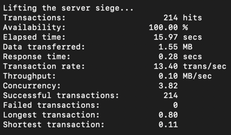
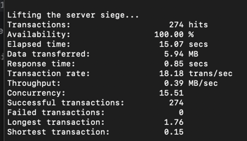
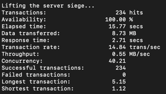
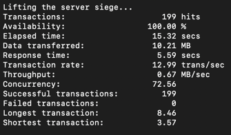

# Currency Application for Siege

This application is built using Python and the FastAPI framework. It fetches and saves currency data, and then lists the currencies.

## Files

- `app/models/currency.py`: This file contains the `CurrencyData` model, which includes the currency code, value, and date.

- `app/routers/currency.py`: This file contains the router for the application. It includes the `fetch_and_save_currencies` function, which fetches the currency data, saves it, and then lists the currencies.

- `requirements.txt`: This file contains the list of dependencies for the application.

## Docker

This application can be built and run using Docker. Here are the steps:

1. Build the Docker image:

```
docker build -t currency-app .
```

2. Run the Docker container:

```
docker run -p 8000:8000 currency-app
```

After running the above commands, the application should be accessible at `http://localhost:8000`.

## Stress Testing with Siege

[Siege](https://www.joedog.org/siege-home/) is a load testing and benchmarking utility that can be used to stress test this application. You can install it and run it against your application to measure its performance under load.

To install Siege, you can use the following command:

```
sudo apt-get install siege
```

To run Siege against your application, you can use the following command:

```
siege -c5 -t1M http://localhost:8000
```

In this command, `-c5` means that Siege will simulate 5 concurrent users, and `-t1M` means that the test will run for 1 minute.

## Test Result c10

We have conducted a test using the following command:

```
siege -c10 -d1 -t15s http://localhost:8000/api/
```

This test simulates 10 concurrent users (`-c10`), with a delay of 1 second between each request (`-d1`), and the test runs for 15 seconds (`-t15s`).

The results of the test are shown in the following image:



## Test Result c25

We have conducted another test using the following command:

```
siege -c25 -d1 -t15s http://localhost:8000/api/
```

This test simulates 25 concurrent users (`-c25`), with a delay of 1 second between each request (`-d1`), and the test runs for 15 seconds (`-t15s`).

The results of the test are shown in the following image:



## Test Result c50

We have conducted another test using the following command:

```
siege -c50 -d1 -t15s http://localhost/api/
```

This test simulates 50 concurrent users (`-c50`), with a delay of 1 second between each request (`-d1`), and the test runs for 15 seconds (`-t15s`).

The results of the test are shown in the following image:



## Test Result c100

We have conducted another test using the following command:

```
siege -c100 -d1 -t15s http://localhost:8000/api/
```

This test simulates 100 concurrent users (`-c100`), with a delay of 1 second between each request (`-d1`), and the test runs for 15 seconds (`-t15s`).

The results of the test are shown in the following image:

